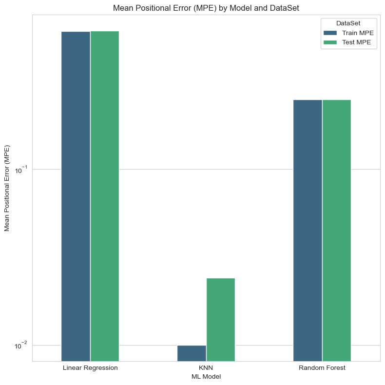

# Machine Learning Enhanced Localization in 5G Networks
## Overview
This project aims to enhance the localization accuracy in 5G networks through machine learning techniques. It involves the application of various regression models to predict geographic locations based on signal attributes. This repository contains Jupyter notebooks demonstrating the data preprocessing, model training, evaluation, and comparison of different machine learning algorithms, including Linear Regression, K-Nearest Neighbors, and Random Forest, for the task of localization using 5G signal data.

## Getting Started
These instructions will guide you on how to set up your environment to run the notebooks included in this project.

## Prerequisites
Python 3.8 or higher
pip (Python Package Installer)

## Installation
Clone the Repository

```bash
git clone https://github.com/Andreas-Espelund/ML_localization_5G.git
cd ML_localization_5G
```


## Running the Notebooks
Start Jupyter Notebook Server

``` bash
jupyter notebook
```

Navigate to the Notebook
In the Notebook Dashboard, navigate through the directory structure and open the notebook file (.ipynb) you wish to run.

Run the Notebook
Execute the cells in the notebook by selecting each cell and clicking the Run button or pressing Shift + Enter.

## Models and Techniques
This project explores the following machine learning models and techniques:

**Linear Regression**: A baseline model for continuous variable prediction.

**K-Nearest Neighbors (KNN)**: A non-parametric method used for classification and regression.

**Random Forest**: An ensemble learning method for regression and classification.
The notebooks detail the process of feature selection, model training, performance evaluation, and comparison to enhance the accuracy of localization in 5G networks.

## Contributing
Feel free to fork this repository and submit pull requests to contribute to this project.


## Data
The .csv files are generated from the raw data from
https://zenodo.org/records/8161173


## Results
These are the results from running the notebook, these results are not verified and I have not
tested this against anything else. I'm still in the experimental phase in regard to both the fingerprinting
techniques, Machine Learning and statistics in general, so take this with a pinch of salt.




## Acknowledgments

K. Kousias, M. Rajiullah, G. Caso, U. Ali, Ö. Alay, A. Brunstrom, L. De Nardis, M. Neri, and M.-G. Di Benedetto, "A Large-Scale Dataset of 4G, NB-IoT, and 5G Non-Standalone Network Measurements," submitted to IEEE Communications Magazine, 2023

L. De Nardis, G. Caso, Ö. Alay, U. Ali, M. Neri, A. Brunstrom and M.-G. Di Benedetto, "Positioning by Multicell Fingerprinting in Urban NB-IoT networks," Sensors, Volume 23, Issue 9, Article ID 4266, April 2023. DOI: 10.3390/s23094266